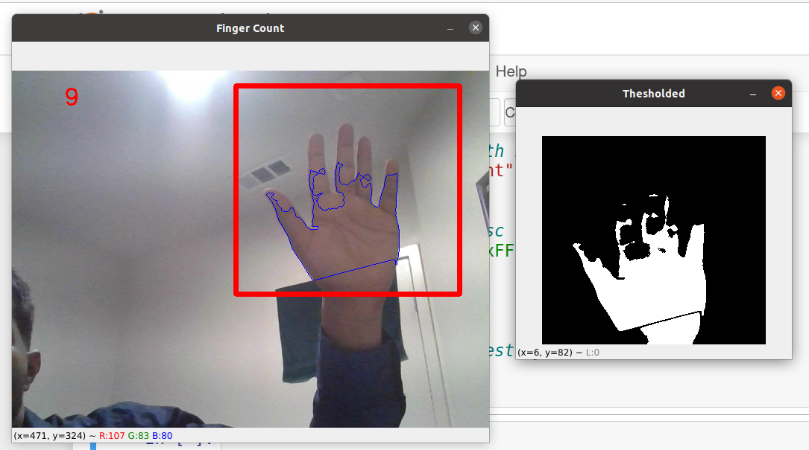

# Deep Learning Projects
"Deep Learning Projects" is a repository housing a collection of my diverse and impactful ventures in the realm of deep learning. From innovative applications to intricate models, these projects showcase a fusion of creativity and technical expertise. Explore this repository to witness the breadth and excellence of my work in the dynamic field of deep learning.

# Installation
- [Numpy](https://pypi.org/project/numpy/)
- [Media Pipe](https://pypi.org/project/mediapipe/)
- [Open Cv](https://pypi.org/project/opencv-python/)
- [Matplotlib](https://pypi.org/project/matplotlib/)

# Projects
## [Image Bluring Using Hand Gesture](Image_Bluring_Using_Hand_Gesture)
In the 'Image Blurring Using Hand Gesture' project, I employed the MediaPipe library to detect hand gestures. The project involves calculating the distance between the thumb and index finger, utilizing this information to dynamically adjust the blurriness of the camera feed. By leveraging the capabilities of the MediaPipe library, this initiative explores an interactive and hands-on approach to controlling image blurring through intuitive hand gestures.

## [Fingure Counter Using Computer Vision](Fingure_Counter_Using_Computer_Vision)
In this project, I have implemented a basic computer vision approach to count fingers. While the project may not be flawless, it represents a commendable effort in exploring and experimenting with computer vision techniques. The implementation, though simple, provides a foundation for further enhancements and improvements. Despite its imperfections, this project stands as a valuable attempt to delve into the realm of computer vision and finger counting, showcasing a willingness to learn and explore new technologies.

## [License Plate Recognition]()
The "License Plate Recognition Using EasyOCR" project involved the utilization of the EasyOCR library for efficient license plate recognition. This versatile project is designed to seamlessly handle both camera feeds and static images. By incorporating the EasyOCR library, the system demonstrates its capability to perform optical character recognition on license plates, making it a powerful tool for extracting valuable information from images and video streams.

## [neural_network_from_scratch](neural_network_from_scratch)
"Neural_Network_From_Scratch" stands as a noteworthy project where the absence of sophisticated libraries such as TensorFlow becomes its defining feature. This endeavor delves into the fundamentals of deep learning by constructing a basic neural network entirely from scratch. Eschewing the conveniences of established frameworks, this project offers a hands-on experience in comprehending the essential steps involved in training a neural network. Serving as an ideal learning platform, it empowers enthusiasts and learners to grasp the foundational principles of model training in the realm of deep learning. By prioritizing simplicity and transparency, this project becomes an invaluable resource for those seeking a solid understanding of the core concepts underlying neural network development.

## [Virtual Gym Assistant](Virtual_Gym_Assistant)
The "Virtual Gym Assistant" is a program that harnesses the capabilities of the MediaPipe library to detect key points on the human body. This innovative application is specifically designed to assist users in tracking and counting repetitions during bicep curls. By leveraging the precision and versatility of the MediaPipe library, the program accurately identifies key landmarks on the user's body, enabling a real-time count of bicep curl repetitions. This integration of computer vision technology into fitness monitoring not only enhances the user experience but also showcases a creative utilization of technology for health and wellness purposes. The Virtual Gym Assistant project exemplifies the fusion of computer vision and fitness, providing users with a virtual training companion that aids in maintaining proper form and achieving their exercise goals.

